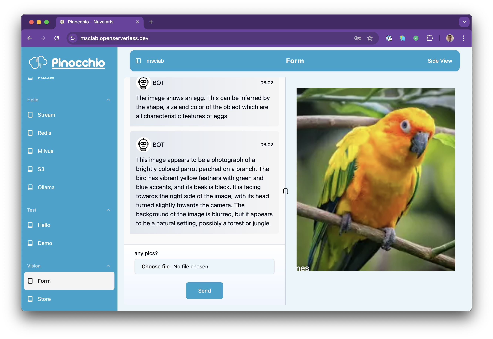

### Developing Open LLM applications with

<center>

</center>

## Lesson 5

## Vision and Storage 

---


## Vision and Storage

---


---

# How to do Vision with Ollama

- Use a vision model: `llama3.2-vision:11b``

- URL:  `https://<url>/api/chat`
- Post an image in base64 format:

```python
msg = {
    "model": MODEL,
    "messages": [ {
        "role": "user",
        "content": "what is in this image?",
        "images": [img]
    } ]
}
```

---
# Example

```
```

---

# Vision Form

- Form to upload a file:

```python
FORM = [{
    "label": "any pics?",
    "name": "pic",
    "required": "true",
    "type": "file"
}]
```

- Retrieve base64 encoded image:

```python
  if type(inp) is dict and "form" in inp:
    img = inp.get("form", {}).get("pic", "")
```

---

# Vision Form

- A Vision Class

```
!code packages/vision/form/vision.py
!code tests/vision/test_form.py
```

- The Vision Form action
```
!code packages/vision/form/form.py
```
---



---


---
# Accessing S3

---


