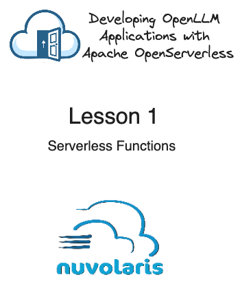
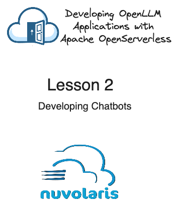
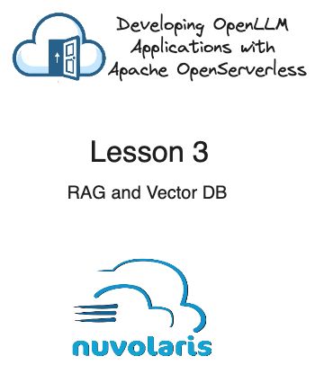
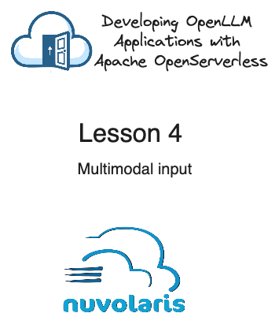
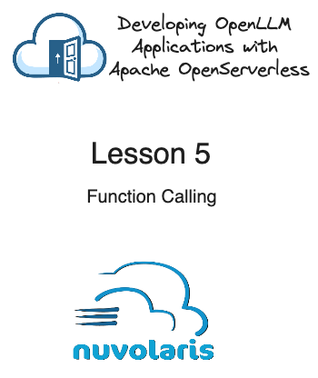

# MastroGPT Course
### Developing Open LLM applications with Apache OpenServerless 

https://www.nuvolaris.io

---

## 1. Serveless Functions

- #### Enviroment Setup
- #### Serverless Functions
- #### Generation API
- #### Sample: post generator

---

## 2. Developing Chatbots

- #### Chat api with roles
- #### Keeping a State
- #### Streaming
- #### Sample: site navigator chatbot

---

## 3. RAG and VectorDB

- #### Embedding
- #### Vector DB
- #### Sample: querying a document

---

## 4. Function Calling

- #### Function calling
- #### Using serverless functions
- #### Sample: github project inspector

---

## 5. Agents

- #### Sample: linkedin agent

---

## 6. Serverless GPU

- #### GPU functions
- #### Sample: generating images
